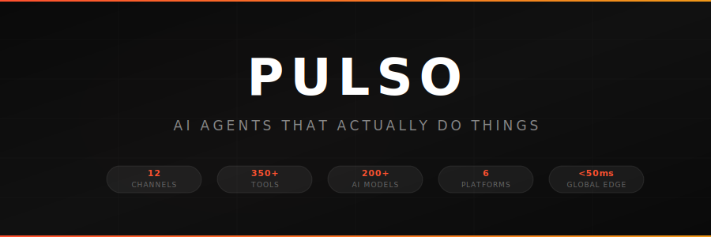
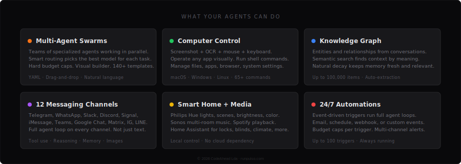
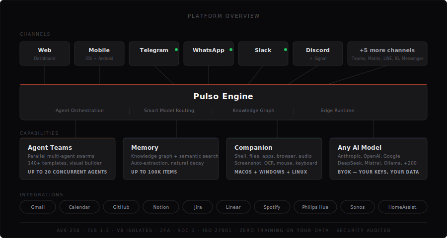

<p align="center">
  <a href="https://app.runpulso.com">
    
  </a>
</p>

<p align="center">
  <a href="https://app.runpulso.com"></a>
  &nbsp;
  <a href="https://www.npmjs.com/package/@pulso/companion"></a>
  &nbsp;
  <a href="https://x.com/usepulso"></a>
</p>

<br />

> **Tired of AI that just talks?** Every chatbot in 2026 does the same thing — you type, it types back, you still do everything yourself. Heavy, bloated, insecure apps that promise automation and deliver autocomplete.
>
> **Pulso agents execute.** They check your email, deploy your code, message your team, control your computer, and work together — from any device, any channel, any AI model.

<br />

---

<br />

## See what's possible

<br />

### Deploy an app from your phone

```
You (WhatsApp, 11:47 PM):
    "Run the test suite for the backend, if everything passes
     build and deploy to production. Send me the URL when done."

Pulso (3 agents, 38 seconds):

    Test Agent
    ├─ Ran 247 tests via Companion
    ├─ 247 passed, 0 failed
    └─ Coverage: 94.2%

    Build Agent
    ├─ Built production bundle (3.2 MB gzipped)
    └─ Deployed to Cloudflare Pages

    Verification Agent
    ├─ Health check: 200 OK (34ms)
    └─ All 12 API endpoints responding

    ✓ Live at https://your-app.pages.dev
    ✓ Deploy log saved to your drive
```

<br />

### Research and write a 20-page report while you sleep

```
You (Telegram, before bed):
    "Research the European AI regulation landscape for 2026.
     Compare at least 8 countries. Write a professional report
     with executive summary, charts data, and recommendations."

Pulso (5 agents, 4 minutes, $0.12):

    3 Research Agents (running in parallel)
    ├─ Deep web search across 140+ sources
    ├─ Analyzed regulations in 11 EU countries
    └─ Cross-referenced with published legal databases

    Analysis Agent
    ├─ Identified 7 key regulatory trends
    ├─ Built comparison matrix
    └─ Mapped compliance timelines

    Writer Agent
    ├─ 22-page PDF with executive summary
    ├─ 6 data visualizations
    └─ Saved to your Google Drive

    ✓ Report delivered to your email
    ✓ Notification sent to Slack #research
```

<br />

### Set up a new developer machine in one command

```
You (Web Chat):
    "Configure this new MacBook for full-stack development.
     Install everything I usually use."

Pulso (Companion Agent, 6 minutes):

    ├─ Installed Homebrew, Node 22, Python 3.12, Rust, Go
    ├─ Installed VS Code + 14 extensions from your preferences
    ├─ Cloned your 8 pinned GitHub repos
    ├─ Configured git (name, email, GPG key)
    ├─ Set up SSH keys for GitHub and your servers
    ├─ Installed Docker Desktop, Postgres, Redis
    ├─ Applied your dotfiles (.zshrc, .gitconfig, .vimrc)
    ├─ Set dark mode, Dock preferences, keyboard shortcuts
    └─ Set up 1Password CLI integration

    ✓ Ready to code. Total: 47 packages, 14 extensions, 8 repos.
```

<br />

### Monitor your infrastructure 24/7

```
Automation (runs every 5 minutes, $0.001/check):

    Trigger: Scheduled health check
    Agent:   Check all production endpoints

    ├─ api.yourapp.com: 200 OK (23ms)
    ├─ app.yourapp.com: 200 OK (45ms)
    ├─ db.yourapp.com:  200 OK (12ms)
    ╰─ cdn.yourapp.com: ⚠️ 503 (timeout)

    → Agent detected CDN issue
    → Automatically restarted CDN origin
    → Verified recovery: 200 OK (38ms)
    → Alert sent to Telegram + Slack with full timeline
```

<br />

### Manage your life from Telegram

```
You (Telegram):
    "What's my week looking like? Cancel anything that's not
     essential and book a dentist appointment for Thursday."

Pulso (2 agents, 8 seconds):

    Calendar Agent
    ├─ Monday: 3 meetings (kept: client call, standup)
    ├─ Tuesday: 2 meetings (cancelled: optional sync)
    ├─ Wednesday: 4 meetings (cancelled: 2 low-priority)
    ├─ Thursday: 1 meeting → booked dentist at 2 PM
    └─ Friday: clear

    Communication Agent
    ├─ Sent cancellation emails with apologies
    ├─ Found Dr. Silva with Thursday availability
    └─ Booked appointment, confirmation in your inbox

    ✓ Freed up 4.5 hours this week
```

<br />

---

<br />

<p align="center">
  
</p>

<br />

---

<br />

## Download

<table>
  <tr>
    <td align="center" width="180">
      <a href="https://app.runpulso.com">
        
      </a>
      <br /><sub>Dashboard · Chat · Builder</sub>
    </td>
    <td align="center" width="180">
      <a href="https://apps.apple.com/app/pulso-ai-agents/id6740000000">
        
      </a>
      <br /><sub>iPhone · iPad</sub>
    </td>
    <td align="center" width="180">
      <a href="https://play.google.com/store/apps/details?id=com.runpulso.app">
        
      </a>
      <br /><sub>Phone · Tablet</sub>
    </td>
  </tr>
  <tr>
    <td align="center">
      <a href="https://www.npmjs.com/package/@pulso/companion">
        
      </a>
      <br /><sub>macOS · Windows · Linux</sub>
    </td>
    <td align="center">
      <a href="https://github.com/usepulso/pulso/releases">
        
      </a>
      <br /><sub>Native macOS app</sub>
    </td>
    <td align="center">
      <a href="https://api.runpulso.com">
        
      </a>
      <br /><sub>REST · SSE · WebSocket</sub>
    </td>
  </tr>
</table>

<br />

---

<br />

<p align="center">
  
</p>

<br />

---

<br />

## Pricing

| | **Solo** | **Swarm** | **Fleet** |
|---|:---:|:---:|:---:|
| | Free | **$19**/mo | **$49**/mo |
| Channels | 1 | 12 | Unlimited |
| Agent Teams | — | Up to 10 | Up to 20 |
| Memory | 100 | 10,000 | 100,000 |
| Companion | — | Included | Included |
| Automations | — | 10 triggers | 100 triggers |
| MCP Servers | — | 5 | 50 |
| Credits | — | $5/mo included | $20/mo included |

<p align="center"><sub>All plans include BYOK (Bring Your Own Key) at zero cost. Your keys, your models, your data.</sub></p>

<br />

---

<br />

## Get started in 60 seconds

```bash
# 1. Sign up (free)
open https://app.runpulso.com

# 2. Add your API keys → Settings → Providers
#    (Anthropic, OpenAI, Google, DeepSeek, Mistral, Ollama, OpenRouter)

# 3. Start chatting — your agent is ready

# 4. Want computer control? Install the Companion:
npm install -g @pulso/companion
pulso-companion login
```

<br />

---

<br />

<p align="center">
  <a href="https://app.runpulso.com"></a>
</p>

<p align="center">
  <sub>
    <a href="https://github.com/usepulso/pulso/issues/new?template=bug_report.md">Report Bug</a> ·
    <a href="https://github.com/usepulso/pulso/issues/new?template=feature_request.md">Request Feature</a> ·
    <a href="https://github.com/usepulso/pulso/discussions">Discussions</a> ·
    <a href="SECURITY.md">Security</a>
  </sub>
</p>

<p align="center">
  <sub>
    <a href="https://app.runpulso.com/terms">Terms</a> ·
    <a href="https://app.runpulso.com/privacy">Privacy</a> ·
    <a href="https://app.runpulso.com/cookies">Cookies</a> ·
    <a href="https://app.runpulso.com/acceptable-use">Acceptable Use</a>
  </sub>
</p>

<br />

<p align="center">
  <sub>Built by <a href="https://codeahead.pt">CodeAhead</a> in Portugal · © 2026 CodeAhead Lda · All rights reserved</sub>
</p>
